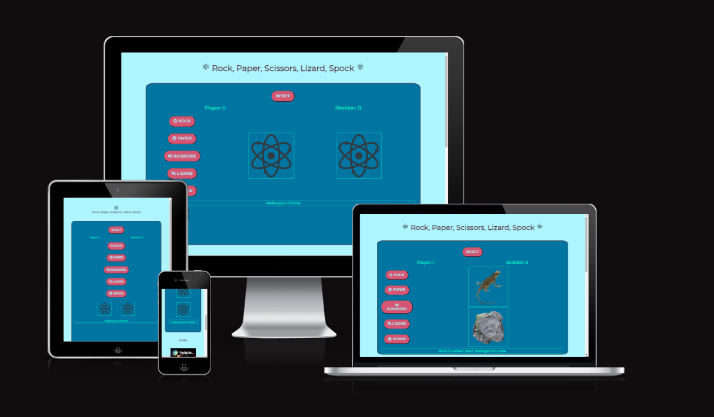

# Rock Paper Scissors Lizard Spock

## UX

### Site Purpose:

### Site Goal:

### Audience:

### Communication:

## Design

### Colours:
The colour palette was generated using coolers.co to create a visually appealing colour scheme for the website. the different shades of blue provide a nice shading for the main body of the page, while the dark brown and green colours provide a nice constrast for the font against each of the blues. The blush red for the game buttons was chosen to make them stand out to the user, while the dark brown provided the nice hover effect adding that interactive feel.

### Fonts:

### Images:

## Features 

### Existing Features

### Landing Page

- __Footer__ 

  - The footer section includes social media links to each of the four main social media platforms. The links will open to a new tab to allow easy navigation for the user. 
  - The footer is valuable to the user as it encourages them to keep connected via social media and keep up to date about future releases.
  - The footer is available across all pages on the site to maintain the theming and style across the website. 

### Features Left to Implement

## Testing 

### Validator Testing 

The HTML and CSS code were passed through the official W3C and Jigsaw Validators respectively and the results are outlined below

- HTML
  
  - [W3C validator](https://validator.w3.org/nu/?doc=https%3A%2F%2Fcode-institute-org.github.io%2Flove-running-2.0%2Findex.html)
   
  

- CSS
  - Stylesheet returned no error when passed through the official [(Jigsaw) validator](https://jigsaw.w3.org/css-validator/validator?uri=https%3A%2F%2Fvalidator.w3.org%2Fnu%2F%3Fdoc%3Dhttps%253A%252F%252Fcode-institute-org.github.io%252Flove-running-2.0%252Findex.html&profile=css3svg&usermedium=all&warning=1&vextwarning=&lang=en#css)
   
  

### Unfixed Bugs

## Deployment
- The site was deployed to GitHub pages. The steps to deploy are as follows: 
  - In the GitHub repository, navigate to the Settings tab 
  - From the source section drop-down menu, select the Master Branch
  - Once the master branch has been selected, the page will be automatically refreshed with a detailed ribbon display to indicate the successful deployment. 

The live link can be found here - 

## Credits 

### Content 

### Media