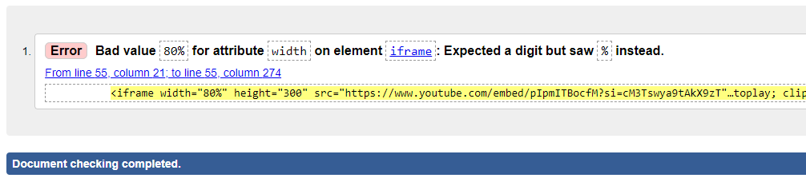
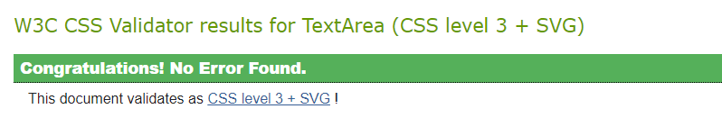
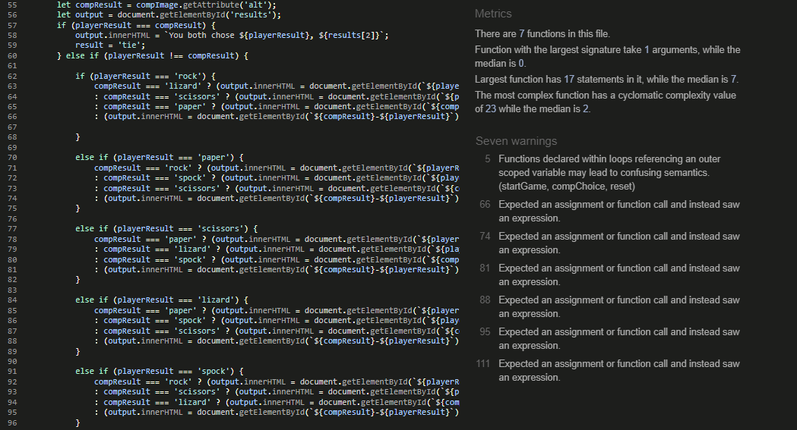

# Rock Paper Scissors Lizard Spock

Welcome to Rock, Paper, Scissors, Lizard, Spock. An interactive web game based off of the twist on the classic "Rock, Paper Scissors" game made popular by the television show The Big Bang Theory. Playing against Dr. Sheldon Cooper (simulated by the computer), the player makes an input using one of the button inputs. 

The player will make a choice to start the game and the backend logic will randomly generate a choice for the computer and then evaluate a winner based on the rock, paper, scissors, lizard, spock rules. Once a winner has been calculated the scores are updated and the player is free to play again, you are free to play as many times as you wish and there is also a reset button to return the page to the default with the scores set to zero. 

## UX

### Site Purpose:
The site is designed to provide a simple visually appealing game, for entertainment purposes. The site design was chosen to relate to the source material it was inspired by to evoke a positive emotional response from the user. 

### Audience:
The game was made popular by the hit television show the Big Bang Theory, so incorporates different features to relate back to the television show. The iframe giving the explanation is a direct clip from the television show, also the atom images were chose to again relate back to the television show being similar to the show logo.

### Communication:
All explanations and navigation across the single page has been designed to make the interactions for the user as simple as possible, with clear contrasting colours on the buttoms combined with hover effects clearly convey the interactivity of the game while maintaining an attractive minimalist design.

## Design

### Colours:
The colour palette was generated using coolers.co to create a visually appealing colour scheme for the website. the different shades of blue provide a nice shading for the main body of the page, while the dark brown and green colours provide a nice constrast for the font against each of the blues. The blush red for the game buttons was chosen to make them stand out to the user, while the dark brown provided the nice hover effect adding that interactive feel.

### Fonts:
The Monserrat font was chosen as a modern and attractive font. 

### Images:
The pictures and iframe were both chosen to relate back to the television show evoking an position emotional response from those who have watched the show. 

## Features 

### Existing Features

- Game Area

  - The Game area is displayed with a nice clear layout with interactive buttons presenting interactivity to the user. The Buttons have a hover effect and a pointer cursor to relay again that interactivity to the user. 

- Rules Area

  - The rules are provides a description of the rules of the game in multiple ways to help the user understand how to play. The iframe provides a video explanation, the text explains each of the winning combinations, and the diagram shows a visual representation of the winning flow of the combinations.

- __Footer__ 

  - The footer section includes social media links to each of the four main social media platforms. The links will open to a new tab to allow easy navigation for the user. 
  - The footer is valuable to the user as it encourages them to keep connected via social media and keep up to date about future releases.
  - The footer is available across all pages on the site to maintain the theming and style across the website. 

### Features Left to Implement

For future releases it would be nice to perhaps add a pop up declaring an official winner after a certain number of rounds or when either the player or computer hit a specific score. 

## Testing 

- All external social media links in the footer were tested on the live pages after deployment using GitHub Pages with no issues
- The functionality of the game was tested after deployment, with the discovered bugs fixed and recorded in the [bugs section below](#bugs)

### Validator Testing 

The HTML and CSS code were passed through the official W3C, Jigsaw and JSHint Validators respectively and the results are outlined below

- HTML
  
  - HTML Validation
    - Some minor errors were found during html validation including div structure within heading and gramatical/spelling errors in one element attribute, these were adjusted accordingly
    - Returned error due to frameborder property being deprecated, the error was then removed accordingly and the css updated.
    - Returned error due to using a percentage value for width within the iframe's as this was the same technique demonstrated previously in course material I believed it to be acceptable. 
    - Validated using [W3C validator](https://validator.w3.org/nu/?doc=https%3A%2F%2Fcode-institute-org.github.io%2Flove-running-2.0%2Findex.html)
    
  

- CSS
  - Stylesheet returned no error when passed through the official [(Jigsaw) validator](https://jigsaw.w3.org/css-validator/validator?uri=https%3A%2F%2Fvalidator.w3.org%2Fnu%2F%3Fdoc%3Dhttps%253A%252F%252Fcode-institute-org.github.io%252Flove-running-2.0%252Findex.html&profile=css3svg&usermedium=all&warning=1&vextwarning=&lang=en#css)

  

- Javascript
  - Script returned only a few warnings with most being the same issue regarding each ternary expression when passed through the [JSHint Validator](https://jshint.com/)

  

### Bugs

Most bugs were fixed during development using chrome developer tools to monitor the progress of the site during the development process. Some only were apparent during testing and were subsequently fixed. 
- An error in the javascript meant that even after pressing the reset button the previous scores were remembered and used in any subsequent games. This was fixed by refactoring the reset function so that it updated the global variables ("w" & "l") so that they too were reset to zero when the reset button was pressed.
- An error in the javascript meant that on a tie the computer's score still recieved a point. This was fixed by refactoring the ternary operator to take a tie into account and not update either of the scores.

## Deployment
- The site was deployed to GitHub pages. The steps to deploy are as follows: 
  - In the GitHub repository, navigate to the Settings tab 
  - From the source section drop-down menu, select the Master Branch
  - Once the master branch has been selected, the page will be automatically refreshed with a detailed ribbon display to indicate the successful deployment. 

The live link can be found here - https://jcav23.github.io/Project2-RockPaperScissorsLizardSpock/

## Credits 

The code used for the footer was taken from my previous project and altered to fit to this webpage, changing colors and sizings to be more appropriate. W3 Schools, and Mozilla doumentation was referenced during development to check various syntax, operations and methods along with various web articles to examine different syntax during development. 

### Content 

- The icons from across the webpage were taken from [Font Awesome](https://fontawesome.com/)
- The font was taken from [Google Fonts](https://fonts.google.com/)

### Media

- The iframe video was taken from Youtube and belongs to the TBS account. The clip was taken from The Big Bang Theory and shows Dr. Sheldon Cooper explaining the rules. [Watch here](https://www.youtube.com/watch?v=pIpmITBocfM&t=2s&ab_channel=TBS)
- the atom image was found through a google image search and used both on the page and also used to generate the .ico file for the site's favicon. This was accomplished using an online favicon generator. 
- Most of the game images were taken from the open source [stick-png](https://www.stickpng.com/)
- The image of Mr Spock was taken from a google image search of spock, specifically the picture found [here.](https://lawliberty.org/the-legacy-of-mr-spock-reason-and-reverence/)